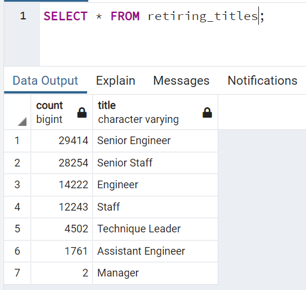
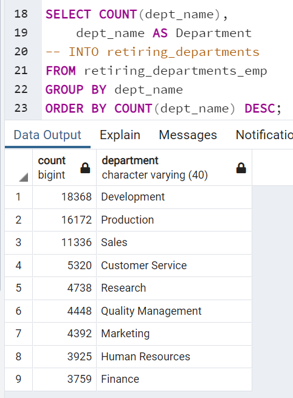

# Pewlett Hackward Analysis

## Overview of the analysis
The purpose of this analysis is to determine the number of retiring employees per title, and identify employees who are eligible to participate in a mentorship program. This analysis helps prepare for Pewlett Hackard's "silver tsunami" as many current employees reach retirement age.

## Results:
Below are 4 major points from the two analysis deliverables:

- The unique table provides data for all employees who are about to retire(born between 1952 and 1955).

- The retiring titles table shows the number of retiring employees that are grouped by titles. As shown in the figure, 2 managers, 1761 assistant engineers, 4502 technique leaders, 12243 staff, 28254 senior staff and 29414 senior engineers are about to retire.

- The sum of retiring titles table adds the numbers from the retiring titles table to retrieve total number of retiring employees in Pewlett Hackard. 90398 employees in Pewlett Hackard are about to retire.

- There are 1549 qualified, retirement-ready employees(born in 1965) in the departments to mentor the next generation of Pewlett Hackard employees.

## Summary

### How many roles will need to be filled as the "silver tsunami" begins to make an impact?
From the retiring titles table above, 90398 roles need to be filled, where 2 managers, 1761 assistant engineers, 4502 technique leaders, 12243 staff, 28254 senior staff and 29414 senior engineers need to be filled to avoid any impact of "silver tsunami".

### Are there enough qualified, retirement-ready employees in the departments to mentor the next generation of Pewlett Hackard employees?
From the sum of retiring titles table and count of mentorship eligibility table, it is shown that there are around 90,000 employees who reach retirement age. It means that 90,000 positions need to be filled soon. Of those 90,000 retiring employees, around 1,500 employees are eligible for mentoring next generation of Pewlett Hackard employees. Therefore it is a 1 : 60 ratio (1,500 : 90,000) of mentors and employees. If the mentors are confident that they can each mentor 60 next generation employees, then there are enough mentors.

### Two additional queries or tables that may provide more insight:

-  By joining employees, dept_emp, departments, and titles on primary keys, and filter current employees with birth dates between 1952 and 1955, a table with all the current retirement-ready employees will be shown with their departments.

After that, by grouping the above table by the departments, the total number of employees who are about to retire in each department is shown. This provides another insight to determine how many employees will be needed in each department when the "silver tsunami" comes.

- As there are 2 managers who are about to retire, the following query retrieves the data of their departments, employee number and names. This helps management to understand which departments need company support most on the "silver tsunami". For instance, sales department's Hauke Zhang and research department's Hilary Kambil are about to retire. Therefore it is best to begin hiring or training next generation employees to take over their positions once they retire to avoid chaos.
